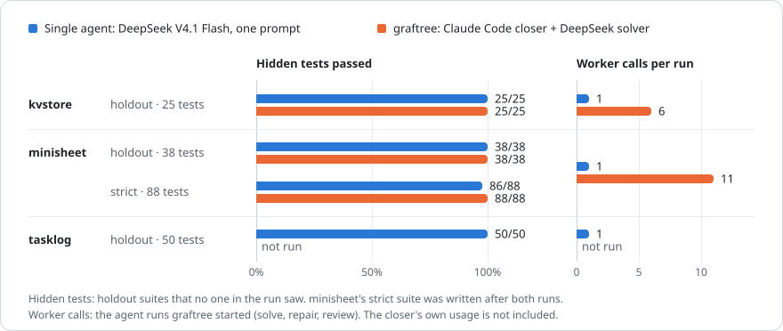

<p align="center">
  <picture>
    <source media="(prefers-color-scheme: dark)" srcset="docs/images/logo-dark.svg">
    
  </picture>
</p>

<h1 align="center">graftree</h1>

<p align="center">
  <b>Tree-structured, test-first, multi-model problem solving for hard coding tasks.</b>
</p>

<p align="center">
  <a href="https://www.npmjs.com/package/graftree-agent"></a>
  <a href="https://github.com/OUM353/graftree/actions/workflows/ci.yml"></a>
  
  <a href="LICENSE"></a>
</p>

<p align="center">
  <a href="#how-it-works">How it works</a> ·
  <a href="#install">Install</a> ·
  <a href="#quick-start-cli">Quick start</a> ·
  <a href="#benchmarks">Benchmarks</a> ·
  <a href="DESIGN.md">Design</a> ·
  <a href="CHANGELOG.md">Changelog</a>
</p>

graftree splits a hard problem into a tree of independent sub-tasks. It writes
acceptance tests *before* any code, then solves each leaf several times in
isolated git worktrees, across different models. The verified results are merged
back up into a single best solution. It trades speed and tokens for accuracy.

> [!WARNING]
> **It uses a lot of tokens.** A run makes many model calls: several attempts
> per sub-task, repairs, reviews and integrations, plus the planning and review
> done by the closer (e.g. Claude Code) itself. Expect roughly **5–30× the
> tokens of one agent solving the task directly**. `graftree plan` prints an
> estimate (`⚠ Cost: expect N–M worker calls`) before you approve, warnings fire
> during a run when usage gets high, and `report.md` lists what was spent. The
> closer's own usage is not included in those numbers; check it in your agent
> (for Claude Code, `/cost`).
>
> **What we measured.** On two benchmarks graded by hidden tests (see
> [Benchmarks](#benchmarks)), a strong single agent that tests its own work was
> about as accurate as graftree, and on a third it scored full marks alone.
> graftree's gain came from its review step: independent reading of the code
> against the spec caught slips the tests missed, for 6–11× the worker calls.
> Use graftree when a wrong answer costs more than that, or when the work is too
> big for one agent session (not yet benchmarked). For everyday tasks, a single
> agent is the better deal.

The agent that invokes it (Claude Code by default) is always the **closer**: it
makes every final decision. Other models, such as DeepSeek via
[CommandCode](https://www.npmjs.com/package/command-code), anything on
OpenRouter, or local models, can do the planning, solving and review work.

## How it works

<p>
  <picture>
    <source media="(prefers-color-scheme: dark)" srcset="docs/images/how-it-works-dark.svg">
    
  </picture>
</p>

## Status

**v1.0.** The full loop works: plan → approval → solve → verify → repair →
review → harden → re-decompose → integrate → close. It is covered by end-to-end
tests with a scripted fake agent, and has run live on Windows with Claude Code
(Opus) as the closer and DeepSeek V4.1 Flash, through CommandCode, as the solver.
OpenRouter tool calling still needs a live test. See
[Verification status](#verification-status) and the [changelog](CHANGELOG.md).

## Install

Pick whichever parts you need. Each one works on its own.

### The skill (Claude Code)

```
/plugin marketplace add OUM353/graftree
/plugin install graftree@graftree
```

Then run `/graftree:graftree <what to solve>`, or ask Claude to "use graftree
to …". For other agents (CommandCode, OpenCode, Codex, …) see
[integrations/AGENTS.md](integrations/AGENTS.md). The skill is a plain folder:
[`plugins/graftree/skills/graftree/`](plugins/graftree/skills/graftree/).

### The CLI

```bash
npm i -g graftree-agent
npx -y graftree-agent --help          # or run it without installing

# The latest main branch (dist/ is prebuilt, no build step):
npm i -g https://codeload.github.com/OUM353/graftree/tar.gz/refs/heads/main
```

This needs Node ≥ 20 and git. It works on Linux, macOS and Windows; CI runs on
all three. (`npm i -g github:…` git installs are unreliable: npm can drop files
while extracting them. Use the tarball URL above.)

### The library

```ts
import { Store, checkPlan, newRun, submitPlan, approveRun, runWorker } from "graftree-agent";
```

The JSON Schemas ship with the package: `graftree-agent/schema/plan.schema.json`,
`subtree.schema.json`, `run.schema.json` and `config.schema.json`.

## Quick start (CLI)

```bash
cd your-repo
graftree init                                    # writes .graftree/config.yaml
graftree new "Fix race in the job scheduler's retry path" --tier focused
# draft tests under .graftree/runs/<id>/tests/<repo path>, write plan.json, then:
graftree plan --file plan.json                   # or: graftree plan --worker cc-deepseek-flash
graftree show                                    # review .graftree/runs/<id>/plan.md
graftree approve --notes "go"                    # or: graftree reject --notes "…"

graftree run                                     # solve + verify + integrate; stops for decisions
graftree diff parser 2                           # inspect a candidate
graftree decide parser 2 --notes "smallest correct diff"
graftree run                                     # continue (integration, next decisions)
graftree close                                   # final checks → branch graftree/<run>/final + report.md
```

The engine never picks winners on its own unless you set `budgets.autoSelect: true`
or pass `run --auto-select` (for CI). When a review finds a real bug the tests missed,
`harden NODE --tests DIR --command "…" --reason "…" --yes` adds new tests (with your OK):
they are locked, existing attempts re-verify, and every one that now fails is repaired.
When a leaf is too big to solve whole, `redecompose NODE --file subtree.json --tests DIR --reason "…"`
splits it into a subtree (new tests added, old tests kept). It pauses for `approve`/`reject` like the first plan.
Other commands: `retry NODE` (more attempts),
`attempt NODE --worktree P` (submit your own candidate through the same gates),
`list`, `lock-check`, `worker test NAME`, `schema`, and `clean` (remove worktrees).
`graftree --help` lists everything.

Add `--json` to any command for machine-readable output; errors then print
`{"ok": false, "error": "…", "code": "…"}`. Exit codes: `0` ok, `1` error,
`2` not accepted (a plan or subtree failed validation, or `harden` without
`--yes`), `3` `lock-check` found changed locked tests, `4` an `attempt` did not
pass its gates, `5` `close`: the final checks failed.

## Benchmarks

Each benchmark is an `examples/` folder with a starter repo, a problem statement
and hidden holdout tests that no one in the run sees. The single agent is
DeepSeek V4.1 Flash through CommandCode with one prompt; graftree used Claude
Code (Opus) as the closer and the same DeepSeek as its solver.

<p>
  <picture>
    <source media="(prefers-color-scheme: dark)" srcset="docs/images/benchmarks-dark.svg">
    
  </picture>
</p>

| Benchmark | What it stresses | Single agent | graftree |
|---|---|---|---|
| [kvstore](examples/kvstore) | Small spec: expiry, nested transactions, a protocol, a CLI | 25/25 | 25/25, 6 worker calls |
| [minisheet](examples/minisheet) | Precise, hard spec: a spreadsheet engine with many interacting rules | 38/38 · strict 86/88 | 38/38 · strict **88/88**, 11 worker calls |
| [tasklog](examples/tasklog) | Vague ticket; the rules live in an existing codebase's conventions | 50/50 | not run |

On minisheet the closer's review found three spec violations that the original
38 tests don't check. A stricter suite, written afterwards, showed the single
agent missed two of the rules it covers. Details, costs and caveats are in each
example's README.

## Examples

- [`examples/calculator`](examples/calculator): a ready-made two-leaf plan. It is the
  cheapest way to see the whole loop, including hardening.
- [`examples/kvstore`](examples/kvstore): a feature request on an existing
  codebase with no plan given, so the planner has to decompose it, graded by a
  25-test holdout. A good first live run.
- [`examples/minisheet`](examples/minisheet): the hard, precise spec. A small
  spreadsheet engine with formulas, coercion, 15-digit numbers, cycles, long
  dependency chains, and row/column edits that rewrite references, graded by a
  38-test holdout plus an 88-test strict suite.
- [`examples/tasklog`](examples/tasklog): a vague feature ticket on an existing
  CLI. Most rules come from the tool's existing conventions (undo journal, file
  lock, dates, tags, errors, file formats), not from the ticket. 50 tests.

## Configure workers

`.graftree/config.yaml` (created by `graftree init`; `graftree schema config`
prints its full schema):

```yaml
version: 1
workers:
  cc-deepseek-flash:                 # CommandCode + DeepSeek V4.1 Flash, headless
    type: cli
    command: [commandcode, -p, "{prompt}", -m, "{model}", --output-format, json,
              --max-turns, "80", --yolo, --trust, --no-session,
              --skip-onboarding, --no-auto-update]
    model: deepseek/deepseek-v4.1-flash
    output: ndjson
  openrouter-x:                      # any OpenAI-compatible endpoint
    type: openai-compatible
    baseUrl: https://openrouter.ai/api/v1
    apiKeyEnv: OPENROUTER_API_KEY    # keys come from env, never from config
    model: <model-id>

roles:                               # "closer" = the invoking agent does it itself
  planner: [closer]
  test_writer: [closer]
  solver: [cc-deepseek-flash, openrouter-x]   # round-robin: mixed models catch each other's mistakes
  integrator: [closer]
  reviewer: [openrouter-x]
```

Smoke-test a worker with `graftree worker test cc-deepseek-flash`. For
CommandCode, install it with `npm i -g command-code` and run `commandcode login` first.

## What gets verified

Each candidate passes through these gates in order. Failing any one of them rules it out:

1. **Locked tests:** the acceptance tests approved by the human are unchanged.
2. **Ownership:** every edit is inside the node's `ownedPaths`. For an
   integration, edits must be in `sharedPaths` or in parent paths that no child owns.
3. **Build:** `commands.build` passes, if set.
4. **Acceptance:** the node's test command passes. For a split, every
   descendant's command must pass too.

Passing candidates are then scored on diff size, lint, repairs needed and review
verdict. The closer decides which one wins.

Reviews look for what the tests missed. Each reviewer also gets the findings raised
on sibling attempts and must confirm or rule out each one for its own candidate.
A finding that proves real can become a hardening test (see above). A repair
invalidates the old review, so repaired code is reviewed again. When
`roles.reviewer` is `closer` (the default), the review is the closer's own
reading of the diffs before it decides.

Every worker call is metered: tokens in and out per attempt, totals in `run`/`show`
output, and a cost section in `report.md`. Warnings fire when usage gets high:
total tokens (`budgets.warnTokens`, default 10M, again at 2×, 3×…), total calls
(`warnCalls`, 100), a single attempt (`warnAttemptTokens`, 2M; usually a looping
agent) and wall time (`warnWallPercent`, 80% of `maxWallMinutes`). They never stop
a run on their own; the skill tells the closer to pause and ask you.

## Verification status

| Part | How it's verified |
|---|---|
| Engine, gates, repair, integration, hardening, re-decomposition, close | Automated end-to-end tests using a scripted fake CLI agent |
| CLI | Tests that run the real CLI process (errors, exit codes, JSON output) |
| API worker tool loop | Tests against a mocked OpenAI-compatible server |
| CommandCode worker | Live on Windows with DeepSeek V4.1 Flash: the calculator (solve, review, hardening + repair, integrate, close), kvstore and minisheet runs. Output parsing is also tested against a captured run |
| Claude Code as the closer | Live: planned, reviewed, decided and closed the kvstore and minisheet runs through the skill |
| OpenRouter | The request format is standard, but **no live call has been made yet** |

## Safety

- Workers run model-written code, and CLI workers typically run with their
  permission prompts bypassed. graftree only ever points them at throwaway git
  worktrees and never pushes. Still, run it on machines and repos where that is
  acceptable, or inside a container.
- Workers and test commands run in their own process groups. A timeout, or
  Ctrl-C on graftree, stops them together with everything they started.
- API keys are read only from environment variables.
- Approval never modifies your working tree, index, or current branch. The base
  commit lives under `refs/graftree/<run>/base`. Results land on their own branches.
- Attempt worktrees live in `.graftree/runs/<id>/wt/` until `close` (or `clean`)
  removes them. If your test runner scans every directory without respecting
  `.gitignore`, exclude `.graftree/` from it.

## Development

```bash
npm install
npm run check      # typecheck + tests
npm run build      # dist/ is committed; rebuild after changing src/
npm run schema     # regenerate schema/*.json after changing src/schema.ts
npm run images     # redraw docs/images/*.svg after changing scripts/gen-images.ts
```

The design and its rationale are in [DESIGN.md](DESIGN.md).

## License

MIT
